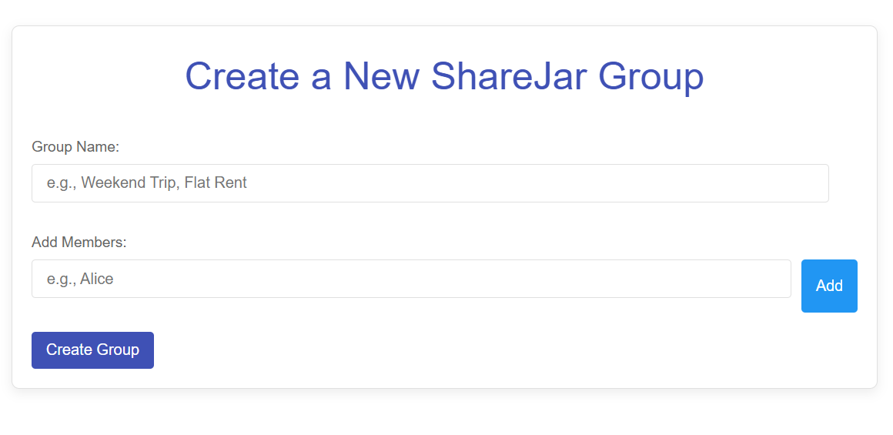
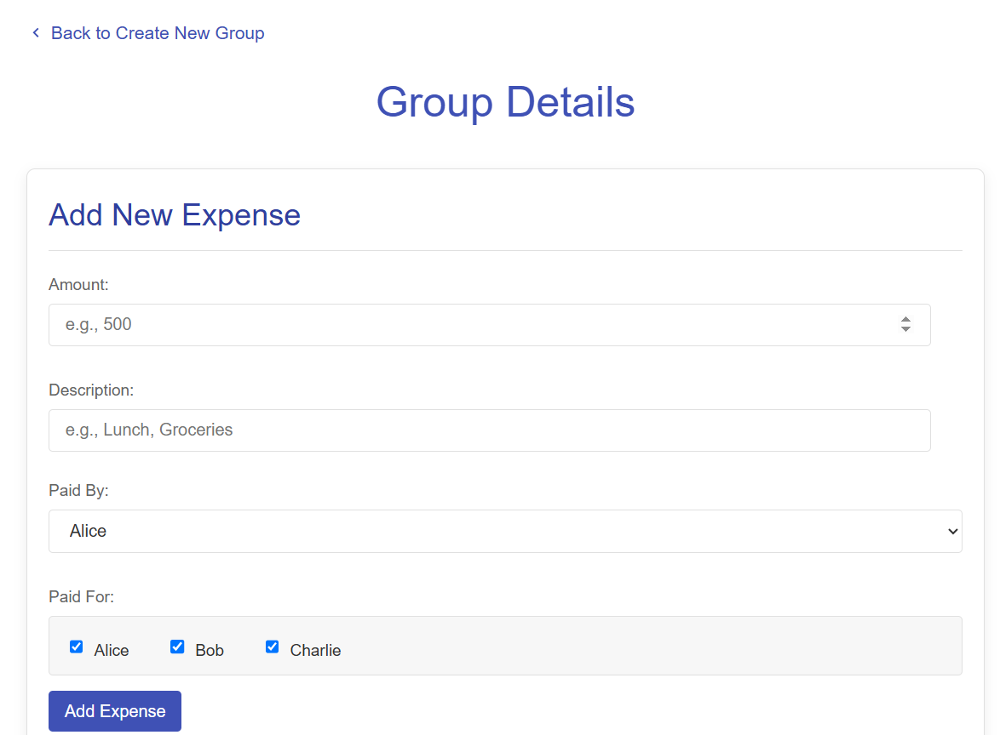

# 💰 ShareJar (Go + React)

A full-stack expense splitting app to help friends track and settle shared expenses seamlessly.

[Visit the deployed frontend](https://sharejar.vercel.app/)

---

## 🖼️ UI Preview

  
  

---

## 🛠️ Features

- No login/singup
- Create and manage groups
- Record expenses with splits
- Auto-balance who owes whom
- Clean, animated React frontend
- RESTful API backend with Go
- PostgreSQL database integration

---